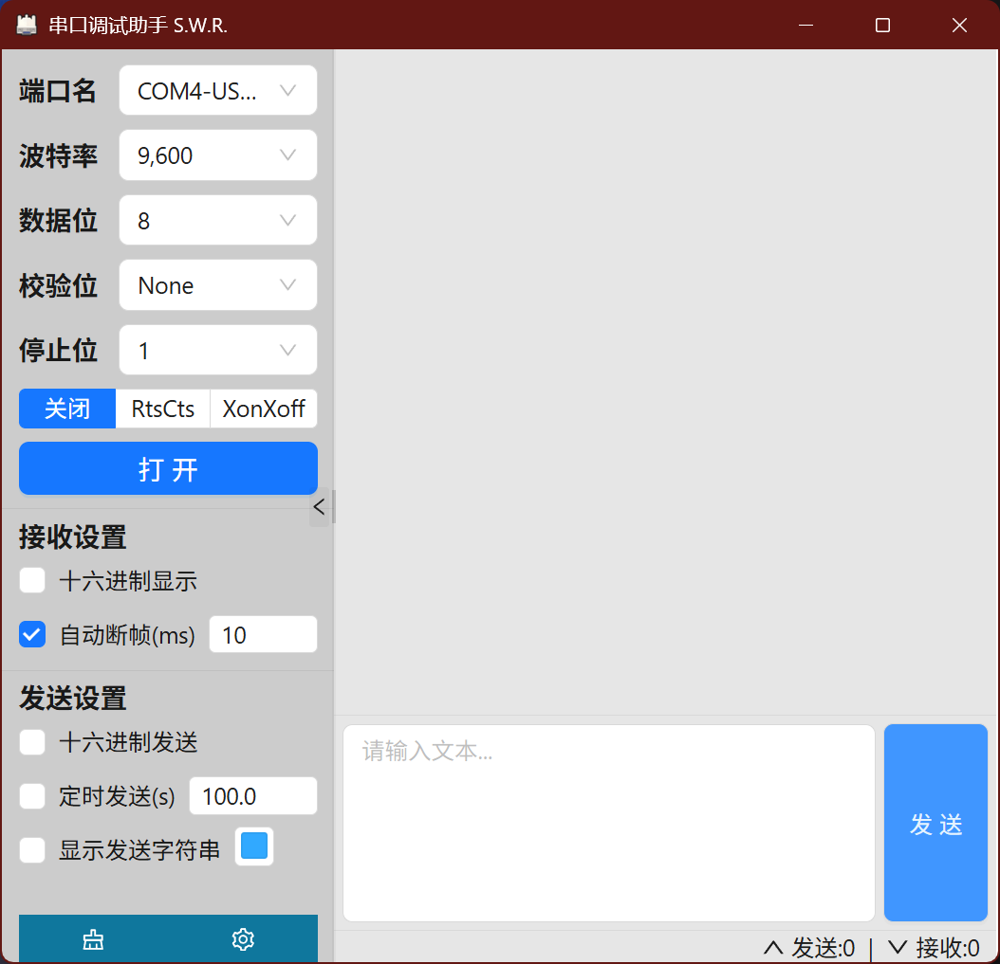

# SerialWatch

一个基于 Tauri + Rust + React 的串口监视工具。

## 使用说明

需要安装webview2

win10-11一般已经自带，也可以去https://developer.microsoft.com/en-us/microsoft-edge/webview2/?form=MA13LH下载

也可以选择setup安装包，会帮助完成安装

Linux需要安装libwebkit2gtk

debian
``` sh
sudo apt install libwebkit2gtk-4.1-dev
```

fedora
``` sh
sudo dnf install webkit2gtk4.1-devel
```


## 系统支持

- Ubuntu 22 及以上版本
- Windows 10 及以上版本

## 技术栈

- Tauri
- Rust
- React

## 已知限制

- 不支持 1.5 停止位（原因：tokio-serial 尚未实现该功能）

## 截图



## Q&A

**Q: 为什么当我关闭十六进制显示时，之前以十六进制显示的数据也会改变为ascii显示？**

> **A**: 为了正确处理UTF8（多字节文本）数据，助手会自动合并之前的数据

**Q: 为什么不提供Mac客户端**

> **A**: 因为我没有Mac

**Q: 如何自己编译**

> **A**: 安装rustup,bun后，使用bun install和bun tauri build编译。您可能还需要配置tauri工具链，参考tauri的Prerequisites